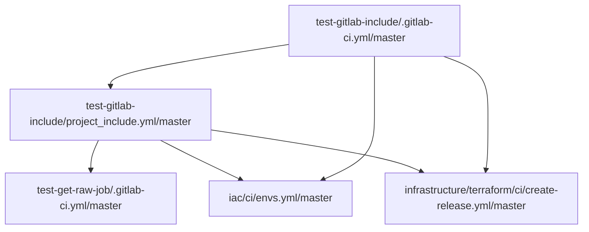

# Gitlab include draftsman

## WIP
Утилита, которая рисует graph include'ов из gitlab-ci


**Как работает пока:**
* Считывает из app.env файла(который должен быть в корне) переменные в формате:
```
TMP_DIR="tmpСonfig"
GITLAB_HOST="gitlab.com"
GITLAB_TOKEN=""
PROJECT_PATH="project/gitlab-include"
REF="master"
GITLAB_CI_FILE=".gitlab-ci.yml"
```
Где всё понятно и только `TOKEN` нужно в gitlab'e создать, нужны ro права на gitlab api, переменные окружения тоже стягивает, они имеют приоритет 

**Билд приложения:**
```
go build -a -o ./draftsman ./ 
```

**Запуск приложения:**
```shell
╭─~/go/src/draftsman ‹master*› 
╰─$ ./draftsman download --help          
Download gitlab-ci config files

Usage:
  draftsman download [flags]

Flags:
  -h, --help   help for download

Global Flags:
      --config string   config file (default is $HOME/.draftsman.yaml)
      
 
╭─~/go/src/draftsman ‹master*› 
╰─$ ./draftsman --config app.env download
Using config file: app.env
Downloading:  tmpСonfig/111/.gitlab-ci.yml
Start parse file: tmpСonfig/111/.gitlab-ci.yml
Downloading:  tmpСonfig/111/project_include.yml
Start parse file: tmpСonfig/111/project_include.yml
Downloading:  tmpСonfig/222/.gitlab-ci.yml
Start parse file: tmpСonfig/222/.gitlab-ci.yml
```


