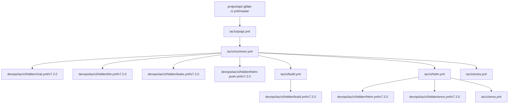

```mermaid
graph TD;
project/api/.gitlab-ci.yml/master --> iac/ci/p/api.yml;
iac/ci/p/api.yml --> iac/ci/common.yml;
iac/ci/common.yml --> devops/iac/ci/hidden/chat.yml/v7.2.0;
iac/ci/common.yml --> devops/iac/ci/hidden/lint.yml/v7.2.0;
iac/ci/common.yml --> devops/iac/ci/hidden/leaks.yml/v7.2.0;
iac/ci/common.yml --> devops/iac/ci/hidden/helm-push.yml/v7.2.0;
iac/ci/common.yml --> iac/ci/build.yml;
iac/ci/build.yml --> devops/iac/ci/hidden/build.yml/v7.2.0;
iac/ci/common.yml --> iac/ci/helm.yml;
iac/ci/helm.yml --> devops/iac/ci/hidden/helm.yml/v7.2.0;
iac/ci/helm.yml --> devops/iac/ci/hidden/envs.yml/v7.2.0;
iac/ci/helm.yml --> iac/ci/envs.yml;
iac/ci/common.yml --> iac/ci/extra.yml;
```